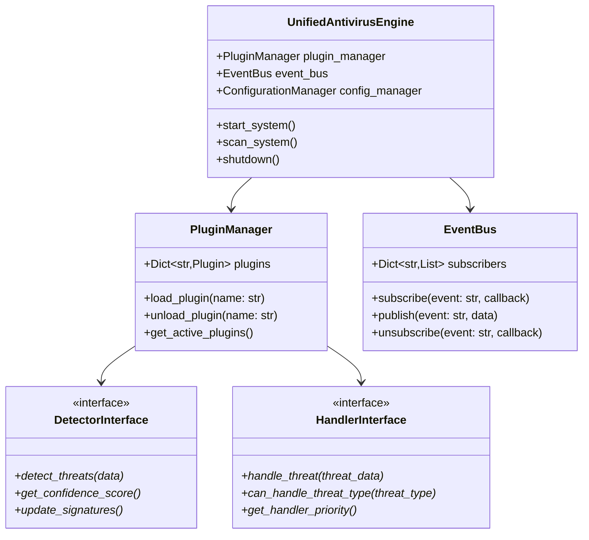
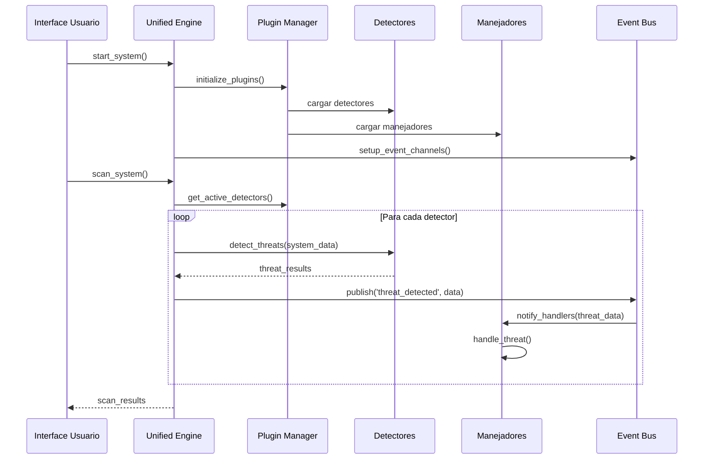
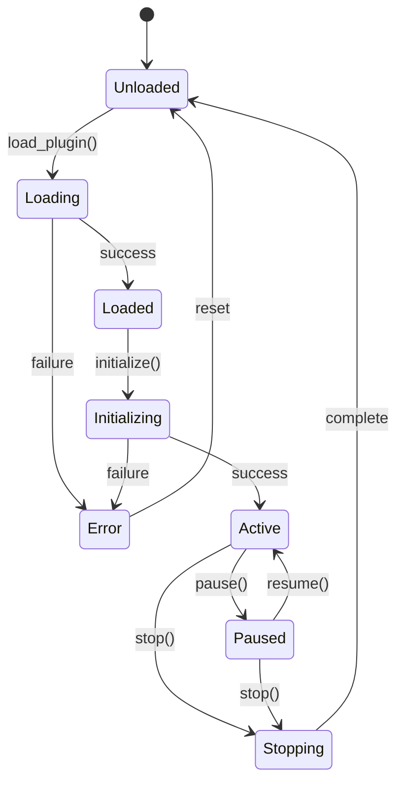

# Documento de Arquitectura de Software - Sistema Antivirus Profesional C++

## Información del Documento

**Proyecto:** Sistema Antivirus Profesional C++  
**Metodología:** RUP (Rational Unified Process)  
**Versión del Documento:** 1.0  
**Fecha:** Diciembre 2024  
**Autor(es):** Equipo de Desarrollo Antivirus  

---

## Tabla de Contenidos

1. [Introducción](#1-introducción)
2. [Visión Arquitectónica](#2-visión-arquitectónica)
3. [Vista Lógica](#3-vista-lógica)
4. [Vista de Implementación](#4-vista-de-implementación)
5. [Vista de Procesos](#5-vista-de-procesos)
6. [Vista de Despliegue](#6-vista-de-despliegue)
7. [Vista de Casos de Uso](#7-vista-de-casos-de-uso)
8. [Patrones de Diseño Aplicados](#8-patrones-de-diseño-aplicados)
9. [Decisiones Arquitectónicas](#9-decisiones-arquitectónicas)
10. [Restricciones y Limitaciones](#10-restricciones-y-limitaciones)
11. [Métricas de Calidad](#11-métricas-de-calidad)

---

## 1. Introducción

### 1.1 Propósito
Este documento describe la arquitectura de software del Sistema Antivirus Profesional C++, siguiendo las mejores prácticas de la metodología RUP. El sistema está diseñado como una solución modular y extensible para la detección, análisis y manejo de amenazas de seguridad.

### 1.2 Alcance
El documento cubre:
- Arquitectura general del sistema híbrido (C++ backend + Python UI)
- Componentes principales y sus responsabilidades
- Patrones de diseño implementados
- Interfaces y comunicación entre módulos
- Configuración y extensibilidad del sistema

### 1.3 Audiencia
- Desarrolladores del equipo
- Arquitectos de software
- Ingenieros de mantenimiento
- Evaluadores de código

---

## 2. Visión Arquitectónica

### 2.1 Arquitectura General
El sistema implementa una **arquitectura híbrida multicapa** que combina:

```
┌─────────────────────────────────────────────────────────┐
│                  CAPA DE PRESENTACIÓN                   │
│  ┌─────────────────┐    ┌─────────────────────────────┐ │
│  │   Python UI     │    │     API REST Server        │ │
│  │   (Tkinter)     │    │     (FastAPI/Flask)        │ │
│  └─────────────────┘    └─────────────────────────────┘ │
└─────────────────────────────────────────────────────────┘
                            │
┌─────────────────────────────────────────────────────────┐
│               CAPA DE LÓGICA DE NEGOCIO                 │
│  ┌─────────────────────────────────────────────────────┐ │
│  │          UNIFIED ANTIVIRUS ENGINE (Python)         │ │
│  │  ┌─────────────┐  ┌─────────────┐ ┌──────────────┐ │ │
│  │  │ Plugin Mgr  │  │ Event Bus   │ │ Config Mgr   │ │ │
│  │  └─────────────┘  └─────────────┘ └──────────────┘ │ │
│  └─────────────────────────────────────────────────────┘ │
└─────────────────────────────────────────────────────────┘
                            │
┌─────────────────────────────────────────────────────────┐
│              CAPA DE PROCESAMIENTO NATIVO              │
│  ┌─────────────────────────────────────────────────────┐ │
│  │            C++ PERFORMANCE ENGINE                   │ │
│  │  ┌─────────────┐  ┌─────────────┐ ┌──────────────┐ │ │
│  │  │ File Scanner│  │ ML Engine   │ │ System Mon   │ │ │
│  │  └─────────────┘  └─────────────┘ └──────────────┘ │ │
│  └─────────────────────────────────────────────────────┘ │
└─────────────────────────────────────────────────────────┘
                            │
┌─────────────────────────────────────────────────────────┐
│                 CAPA DE PERSISTENCIA                    │
│  ┌─────────────┐ ┌─────────────┐ ┌─────────────────────┐ │
│  │ Config Files│ │ ML Models   │ │ Threat Database     │ │
│  │ (JSON/TOML) │ │ (.onnx)     │ │ (SQLite/PostgreSQL) │ │
│  └─────────────┘ └─────────────┘ └─────────────────────┘ │
└─────────────────────────────────────────────────────────┘
```

### 2.2 Principios Arquitectónicos

1. **Separación de Responsabilidades**: Cada componente tiene una responsabilidad específica y bien definida
2. **Modularidad**: Sistema basado en plugins intercambiables
3. **Extensibilidad**: Fácil adición de nuevos detectores y manejadores
4. **Performance**: Core C++ para operaciones intensivas
5. **Configurabilidad**: Sistema altamente configurable sin recompilación
6. **Observabilidad**: Logging y métricas completas

---

## 3. Vista Lógica

### 3.1 Componentes Principales

#### 3.1.1 Unified Antivirus Engine (Python)
**Responsabilidad**: Orquestación central del sistema y coordinación de plugins

**Componentes internos**:
- **PluginManager**: Gestión del ciclo de vida de plugins
- **EventBus**: Comunicación asíncrona entre componentes
- **ConfigurationManager**: Gestión centralizada de configuración
- **ThreatProcessor**: Análisis y procesamiento de amenazas

**Patrones aplicados**:
- **Facade Pattern**: Proporciona interfaz simplificada al sistema complejo
- **Observer Pattern**: Para notificaciones entre componentes
- **Strategy Pattern**: Para algoritmos de detección intercambiables

```python
# Ejemplo de implementación del patrón Facade
class UnifiedAntivirusEngine:
    def __init__(self):
        self.plugin_manager = PluginManager()
        self.event_bus = EventBus()
        self.config_manager = ConfigurationManager()
        
    def scan_system(self) -> ScanResults:
        """Interfaz simplificada para escaneo completo"""
        # Coordina todos los plugins de detección
        return self._orchestrate_scan()
```

#### 3.1.2 Plugin Architecture

**Detectores Disponibles**:
- **BehaviorDetector**: Análisis de comportamiento sospechoso
- **MLDetector**: Detección basada en machine learning
- **NetworkDetector**: Monitoreo de tráfico de red
- **KeyloggerDetector**: Detección de keyloggers

**Manejadores Disponibles**:
- **QuarantineHandler**: Cuarentena de archivos maliciosos
- **AlertManager**: Gestión de alertas y notificaciones
- **LoggerHandler**: Registro detallado de eventos

#### 3.1.3 Interface Definitions (Strategy Pattern)

```python
# Interfaces principales para plugins
class DetectorInterface(ABC):
    @abstractmethod
    def detect_threats(self, data: Dict[str, Any]) -> List[Dict[str, Any]]:
        pass
    
    @abstractmethod
    def get_confidence_score(self) -> float:
        pass

class HandlerInterface(ABC):
    @abstractmethod
    def handle_threat(self, threat_data: Dict[str, Any]) -> bool:
        pass
    
    @abstractmethod
    def can_handle_threat_type(self, threat_type: str) -> bool:
        pass
```

#### 3.1.4 C++ Performance Engine
**Responsabilidad**: Operaciones de alto rendimiento y acceso al sistema

**Componentes**:
- **File Scanner**: Escaneo rápido de archivos
- **ML Engine**: Inferencia de modelos ONNX
- **System Monitor**: Monitoreo de bajo nivel del sistema

### 3.2 Diagrama de Clases Principal



---

## 4. Vista de Implementación

### 4.1 Estructura de Directorios

```
ANTIVIRUS_CPP_PROFESSIONAL/
├── backend/                    # Motor C++ de alto rendimiento
│   ├── src/
│   │   ├── main.cpp           # Punto de entrada C++
│   │   ├── core/              # Motor principal
│   │   ├── ml/                # Integración ML (ONNX)
│   │   └── api/               # API REST
│   ├── include/               # Headers C++
│   ├── models/                # Modelos ML (.onnx)
│   └── CMakeLists.txt         # Configuración build
├── UNIFIED_ANTIVIRUS/         # Sistema Python unificado
│   ├── core/                  # Núcleo del sistema
│   │   ├── engine.py          # Motor principal (Facade)
│   │   ├── plugin_manager.py  # Gestión plugins (Factory)
│   │   ├── event_bus.py       # Bus eventos (Observer)
│   │   └── interfaces.py      # Interfaces (Strategy)
│   ├── plugins/               # Sistema de plugins
│   │   ├── detectors/         # Plugins detectores
│   │   └── handlers/          # Plugins manejadores
│   ├── config/                # Configuración sistema
│   └── utils/                 # Utilidades comunes
├── frontend/                  # Interfaz usuario (Electron)
└── professional_ui_robust.py  # UI principal (Tkinter)
```

### 4.2 Tecnologías y Librerías

#### Python (Coordinación y UI)
- **Core**: Python 3.8+
- **UI**: Tkinter (nativa), Electron (web)
- **Comunicación**: FastAPI, requests
- **Configuración**: TOML, JSON
- **ML**: ONNX Runtime, NumPy

#### C++ (Motor de rendimiento)
- **Estándar**: C++17
- **Build**: CMake
- **ML**: ONNX Runtime C++
- **Concurrencia**: std::thread, std::async
- **API**: REST con bibliotecas nativas

#### Base de Datos
- **Configuración**: Archivos JSON/TOML
- **Logs**: Archivos texto estructurados
- **Modelos**: Formato ONNX
- **Cache**: SQLite (opcional)

---

## 5. Vista de Procesos

### 5.1 Flujo Principal del Sistema



### 5.2 Ciclo de Vida de Plugins



### 5.3 Gestión de Concurrencia

#### Threading Model
- **UI Thread**: Tkinter main loop (single-threaded)
- **Engine Thread**: Coordinación principal
- **Detector Threads**: Análisis paralelo por detector
- **Handler Threads**: Procesamiento de amenazas
- **Monitor Threads**: Monitoreo continuo del sistema

#### Sincronización
- **Event Bus**: Comunicación thread-safe entre componentes
- **Queue Systems**: Para datos entre threads
- **Locks**: Protección de recursos compartidos

---

## 6. Vista de Despliegue

### 6.1 Componentes de Despliegue

```mermaid
deployment
    node "Workstation Usuario" {
        component "UI Tkinter" as UI
        component "Python Engine" as PyEngine
        component "C++ Backend" as CppEngine
        database "Config Files" as Config
        database "ML Models" as Models
    }
    
    node "Sistema Operativo" {
        component "File System" as FS
        component "Network Stack" as Net
        component "Process Monitor" as Proc
    }
    
    UI --> PyEngine: API calls
    PyEngine --> CppEngine: Native calls
    PyEngine --> Config: Read/Write
    CppEngine --> Models: Load models
    CppEngine --> FS: File scanning
    CppEngine --> Net: Network monitoring
    CppEngine --> Proc: Process analysis
```

### 6.2 Requisitos del Sistema

#### Hardware Mínimo
- **CPU**: Dual-core 2.0 GHz
- **RAM**: 4 GB mínimo, 8 GB recomendado
- **Almacenamiento**: 2 GB espacio libre
- **Red**: Conexión internet para updates

#### Software
- **OS**: Windows 10/11, Linux Ubuntu 18.04+
- **Python**: 3.8 o superior
- **C++ Runtime**: Visual C++ Redistributable
- **Dependencias**: Especificadas en requirements.txt

---

## 7. Vista de Casos de Uso

### 7.1 Casos de Uso Principales

```mermaid
usecase
    Usuario --> (Escanear Sistema)
    Usuario --> (Configurar Detectores)
    Usuario --> (Ver Alertas)
    Usuario --> (Revisar Logs)
    
    (Escanear Sistema) --> (Detectar Amenazas)
    (Detectar Amenazas) --> (Procesar Amenaza)
    (Procesar Amenaza) --> (Notificar Usuario)
    
    Administrador --> (Gestionar Plugins)
    Administrador --> (Configurar Sistema)
    Administrador --> (Monitorear Rendimiento)
```

### 7.2 Escenarios de Uso

#### UC-001: Escaneo Completo del Sistema
**Actor**: Usuario  
**Precondiciones**: Sistema iniciado y configurado  
**Flujo Principal**:
1. Usuario solicita escaneo completo
2. Sistema activa todos los detectores
3. Cada detector analiza su área de responsabilidad
4. Resultados se consolidan y presentan
5. Usuario puede revisar amenazas encontradas

#### UC-002: Detección en Tiempo Real
**Actor**: Sistema (automático)  
**Precondiciones**: Monitoreo activo habilitado  
**Flujo Principal**:
1. Monitor detecta actividad sospechosa
2. Event Bus notifica a detectores relevantes
3. Detectores analizan la actividad
4. Si se confirma amenaza, se activan manejadores
5. Usuario recibe notificación inmediata

---

## 8. Patrones de Diseño Aplicados

### 8.1 Facade Pattern (Fachada)
**Ubicación**: `UnifiedAntivirusEngine`  
**Propósito**: Simplificar la interfaz del sistema complejo

```python
class UnifiedAntivirusEngine:
    """Facade que simplifica el acceso al sistema complejo"""
    
    def scan_system(self) -> ScanResults:
        """Una sola llamada para escaneo completo"""
        # Internamente coordina múltiples subsistemas
        detectors = self.plugin_manager.get_active_detectors()
        system_data = self.system_monitor.collect_data()
        
        results = []
        for detector in detectors:
            result = detector.detect_threats(system_data)
            results.extend(result)
            
        return self._consolidate_results(results)
```

### 8.2 Strategy Pattern (Estrategia)
**Ubicación**: Interfaces de plugins  
**Propósito**: Intercambiar algoritmos de detección

```python
class DetectionContext:
    """Contexto que usa diferentes estrategias de detección"""
    
    def __init__(self, strategy: DetectorInterface):
        self.strategy = strategy
    
    def execute_detection(self, data):
        return self.strategy.detect_threats(data)
    
    def change_strategy(self, new_strategy: DetectorInterface):
        self.strategy = new_strategy
```

### 8.3 Observer Pattern (Observador)
**Ubicación**: `EventBus`  
**Propósito**: Notificación de eventos entre componentes

```python
class EventBus:
    """Implementa Observer Pattern para comunicación desacoplada"""
    
    def __init__(self):
        self.subscribers = defaultdict(list)
    
    def subscribe(self, event_type: str, callback: Callable):
        self.subscribers[event_type].append(callback)
    
    def publish(self, event_type: str, data: Dict):
        for callback in self.subscribers[event_type]:
            try:
                callback(data)
            except Exception as e:
                self.logger.error(f"Error in observer: {e}")
```

### 8.4 Abstract Factory Pattern (Fábrica Abstracta)
**Ubicación**: `PluginManager`  
**Propósito**: Creación de familias de plugins

```python
class PluginFactory:
    """Factory para crear diferentes tipos de plugins"""
    
    @staticmethod
    def create_detector(detector_type: str) -> DetectorInterface:
        factories = {
            'behavior': BehaviorDetectorFactory,
            'ml': MLDetectorFactory,
            'network': NetworkDetectorFactory
        }
        return factories[detector_type].create()
    
    @staticmethod
    def create_handler(handler_type: str) -> HandlerInterface:
        factories = {
            'quarantine': QuarantineHandlerFactory,
            'alert': AlertHandlerFactory,
            'logger': LoggerHandlerFactory
        }
        return factories[handler_type].create()
```

### 8.5 Template Method Pattern (Método Plantilla)
**Ubicación**: Base classes de plugins  
**Propósito**: Definir esqueleto de algoritmos

```python
class BaseDetector(DetectorInterface):
    """Template method para detectores"""
    
    def detect_threats(self, data: Dict) -> List[ThreatInfo]:
        # Template method define el flujo
        self.prepare_data(data)
        raw_detections = self.perform_detection(data)
        filtered_detections = self.filter_results(raw_detections)
        return self.format_results(filtered_detections)
    
    @abstractmethod
    def perform_detection(self, data: Dict) -> List:
        """Paso específico que debe implementar cada detector"""
        pass
    
    def prepare_data(self, data: Dict):
        """Paso común con implementación por defecto"""
        pass
```

---

## 9. Decisiones Arquitectónicas

### 9.1 Decisiones Técnicas Clave

#### 9.1.1 Arquitectura Híbrida Python-C++
**Decisión**: Combinar Python para coordinación y C++ para rendimiento  
**Justificación**:
- Python: Desarrollo rápido, plugins flexibles, configuración dinámica
- C++: Rendimiento crítico para escaneo de archivos y ML
- Mejor de ambos mundos para casos de uso específicos

**Alternativas consideradas**:
- Solo C++: Más complejo para plugins y configuración
- Solo Python: Rendimiento insuficiente para escaneo intensivo

#### 9.1.2 Sistema de Plugins Modular
**Decisión**: Arquitectura basada en plugins con interfaces bien definidas  
**Justificación**:
- Extensibilidad: Fácil agregar nuevos detectores
- Mantenimiento: Aislamiento de responsabilidades
- Testing: Componentes testeable independientemente

#### 9.1.3 Event Bus para Comunicación
**Decisión**: Sistema de eventos desacoplado  
**Justificación**:
- Bajo acoplamiento entre componentes
- Fácil extensión sin modificar código existente
- Trazabilidad de eventos para debugging

### 9.2 Trade-offs Importantes

#### Performance vs Flexibilidad
- **Decisión**: Priorizar flexibilidad en coordinación, performance en operaciones críticas
- **Impacto**: Mayor complejidad pero mejor adaptabilidad

#### Configurabilidad vs Simplicidad
- **Decisión**: Sistema altamente configurable con validación de seguridad
- **Impacto**: Curva de aprendizaje más alta pero mayor poder de personalización

---

## 10. Restricciones y Limitaciones

### 10.1 Restricciones Técnicas

#### Hardware
- **CPU**: Mínimo dual-core para operación efectiva
- **Memoria**: Mínimo 4GB RAM, 8GB recomendado
- **Almacenamiento**: SSD recomendado para mejor I/O

#### Software
- **Python**: Versión 3.8+ requerida para type hints
- **OS**: Windows 10+ o Linux moderno
- **Privilegios**: Acceso administrativo para monitoreo completo

### 10.2 Limitaciones de Diseño

#### Escalabilidad
- Diseñado para workstations individuales
- No optimizado para entornos enterprise grandes
- Plugin system tiene límite práctico de ~50 plugins activos

#### Compatibilidad
- Interfaces de plugins pueden cambiar entre versiones mayores
- Dependencia de librerías específicas (ONNX, Tkinter)

---

## 11. Métricas de Calidad

### 11.1 Métricas de Código

#### Complejidad
- **Complejidad Ciclomática**: Objetivo < 10 por método
- **Profundidad de Herencia**: Máximo 4 niveles
- **Acoplamiento**: Bajo acoplamiento entre módulos

#### Cobertura
- **Test Coverage**: Objetivo > 80%
- **Core Components**: Objetivo > 90%
- **Plugin Interfaces**: 100% coverage obligatorio

### 11.2 Métricas de Performance

#### Tiempo de Respuesta
- **Inicio del Sistema**: < 5 segundos
- **Escaneo Completo**: < 2 minutos para 100GB
- **Detección Tiempo Real**: < 100ms latencia

#### Recursos
- **Uso de CPU**: < 20% en idle, < 80% durante escaneo
- **Uso de RAM**: < 500MB base, < 2GB durante escaneo
- **I/O Disk**: Optimizado para no interferir con usuario

### 11.3 Métricas de Calidad

#### Mantenibilidad
- **Tiempo para agregar plugin**: < 4 horas
- **Tiempo para fix de bug**: < 1 día
- **Documentación**: 100% APIs documentadas

#### Fiabilidad
- **MTBF**: > 1000 horas de operación continua
- **Recovery Time**: < 30 segundos tras error
- **Data Integrity**: 100% para configuraciones críticas

---

## Conclusiones

Este documento presenta la arquitectura del Sistema Antivirus Profesional C++, diseñado siguiendo las mejores prácticas de RUP. La arquitectura híbrida Python-C++ proporciona el equilibrio óptimo entre flexibilidad de desarrollo y rendimiento de ejecución.

Los patrones de diseño aplicados (Facade, Strategy, Observer, Factory) aseguran un sistema mantenible, extensible y robusto. El sistema de plugins permite adaptación a nuevas amenazas sin modificar el núcleo del sistema.

### Beneficios de la Arquitectura

1. **Modularidad**: Componentes independientes y reemplazables
2. **Extensibilidad**: Fácil adición de nuevas funcionalidades
3. **Performance**: Operaciones críticas optimizadas en C++
4. **Mantenibilidad**: Código bien estructurado y documentado
5. **Configurabilidad**: Adaptable a diferentes entornos de uso

### Próximos Pasos

1. Implementación completa de todos los detectores planificados
2. Optimización del motor C++ para mejor rendimiento
3. Desarrollo de interfaz web complementaria
4. Integración con sistemas de threat intelligence
5. Certificación de seguridad para uso empresarial

---

**Fin del Documento**

*Este documento será actualizado según evolucione el sistema y se identifiquen nuevos requisitos arquitectónicos.*


# Requisitos de Despliegue - UNIFIED_ANTIVIRUS

## Tabla de Requisitos del Sistema

| Categoría | Componente | Especificación | Obligatorio |
|---|---|---|---|
| **Runtime** | Python | Versión 3.8 o superior | Sí |
| **Sistema Operativo** | OS | Windows 10/11 o Linux (distribuciones principales) | Sí |
| **Hardware - Procesador** | CPU | Mínimo dual-core | Sí |
| **Hardware - Memoria** | RAM | Mínimo 4GB, Recomendado 8GB | Sí |
| **Hardware - Almacenamiento** | Disco | 500MB para instalación completa | Sí |
| **Red** | Conectividad | Para actualizaciones de firmas y plugins | No (Opcional) |

---

## Estructura de Despliegue

| Directorio/Archivo | Descripción | Tamaño Aprox. |
|---|---|---|
| **UNIFIED_ANTIVIRUS/** | Directorio raíz de la aplicación | - |
| ├── **core/** | Componentes principales del núcleo | ~50MB |
| │   ├── engine.py | Motor principal (Facade) | - |
| │   ├── plugin_manager.py | Gestor de plugins (Abstract Factory) | - |
| │   ├── event_bus.py | Bus de eventos (Observer) | - |
| │   ├── interfaces.py | Definiciones de interfaces (Strategy) | - |
| │   └── base_plugin.py | Clase base para plugins | - |
| ├── **plugins/** | Sistema de plugins extensible | ~200MB |
| │   ├── detectors/ | Plugins de detección de amenazas | - |
| │   │   ├── behavior_detector/ | Detector de comportamiento | - |
| │   │   ├── ml_detector/ | Detector basado en ML | - |
| │   │   ├── network_detector/ | Detector de tráfico de red | - |
| │   │   └── keylogger_detector/ | Detector de keyloggers | - |
| │   └── handlers/ | Plugins de respuesta a amenazas | - |
| │       ├── quarantine_handler/ | Gestor de cuarentena | - |
| │       ├── alert_manager/ | Gestor de alertas | - |
| │       └── logger_handler/ | Gestor de logs | - |
| ├── **config/** | Archivos de configuración | ~5MB |
| │   └── *.json | Configuraciones en formato JSON | - |
| ├── **utils/** | Utilidades comunes | ~20MB |
| ├── **professional_ui_robust.py** | Interfaz gráfica principal (Tkinter) | ~10MB |
| └── **logs/** | Directorio de logs (generado en runtime) | Variable |

---

## Recursos del Sistema en Runtime

| Recurso | Uso Normal | Uso Intensivo | Notas |
|---|---|---|---|
| **CPU** | ≤ 20% | ≤ 80% | Durante escaneos completos |
| **RAM** | ~500MB | ~2GB | Picos durante análisis ML |
| **Disco I/O** | Bajo | Medio-Alto | Durante escaneos y cuarentena |
| **Red** | 0 KB/s | < 1 MB/s | Solo para actualizaciones |

---

## Dependencias Externas

| Biblioteca | Versión Mínima | Propósito |
|---|---|---|
| Python | 3.8+ | Runtime principal |
| Tkinter | Incluido en Python | Interfaz gráfica |
| psutil | 5.8+ | Monitoreo de procesos |
| watchdog | 2.1+ | Monitoreo de sistema de archivos |
| numpy | 1.20+ | Análisis ML (opcional) |

---

## Escenarios de Despliegue

### Configuración Mínima (Home User)
- **CPU**: Dual-core 2.0 GHz
- **RAM**: 4GB
- **Disco**: 500MB libres
- **OS**: Windows 10 / Ubuntu 20.04

### Configuración Recomendada (Power User)
- **CPU**: Quad-core 2.5 GHz+
- **RAM**: 8GB+
- **Disco**: 1GB libres (para logs)
- **OS**: Windows 11 / Ubuntu 22.04+

### Configuración Empresarial
- **CPU**: Hexa-core 3.0 GHz+
- **RAM**: 16GB+
- **Disco**: 2GB+ (logs extensivos)
- **Red**: Conectividad estable para actualizaciones automáticas
- **OS**: Windows Server / RHEL