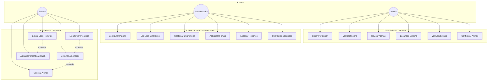
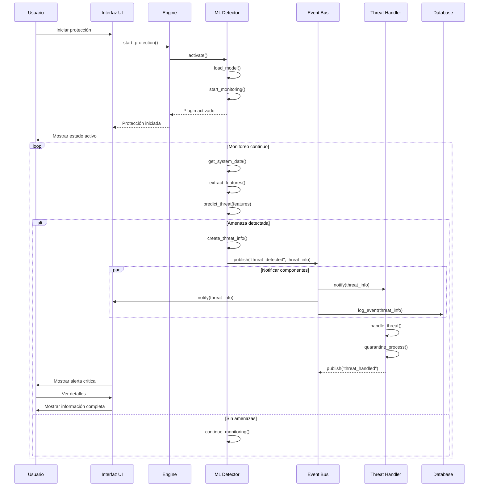
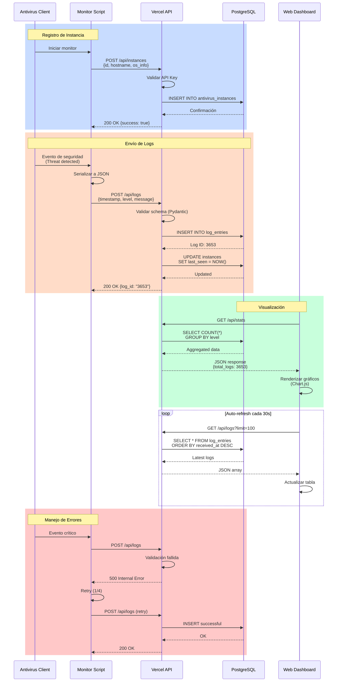
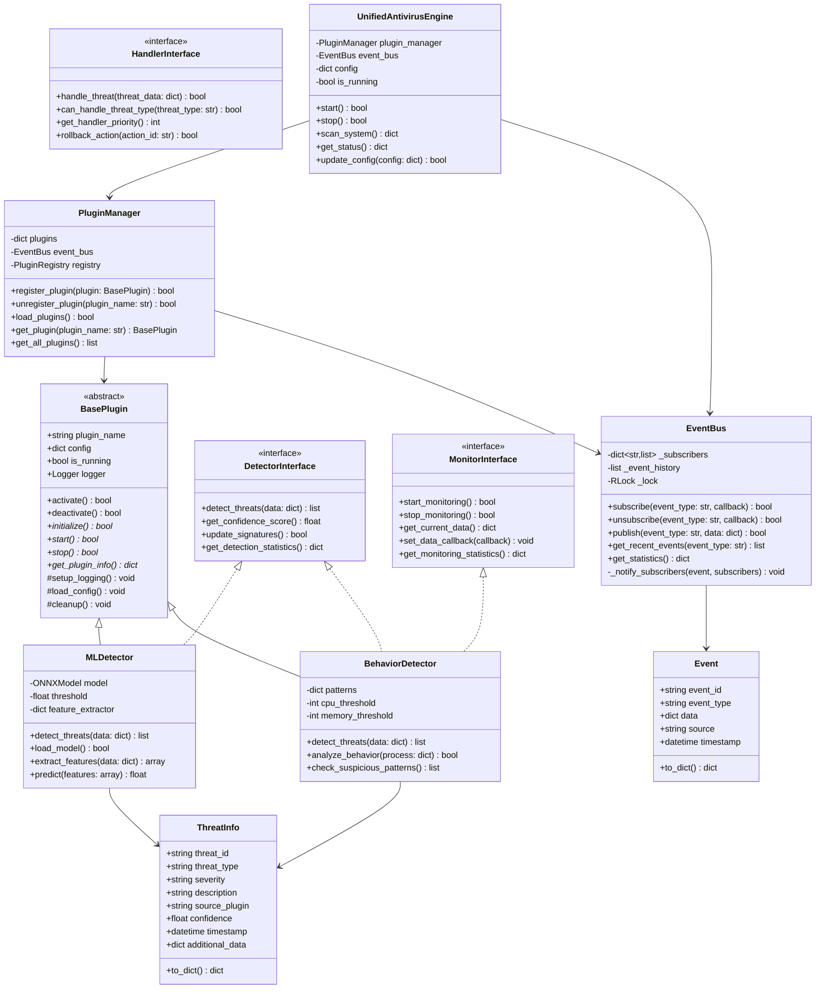
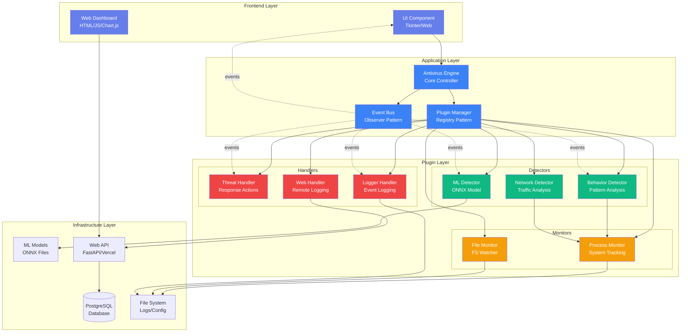
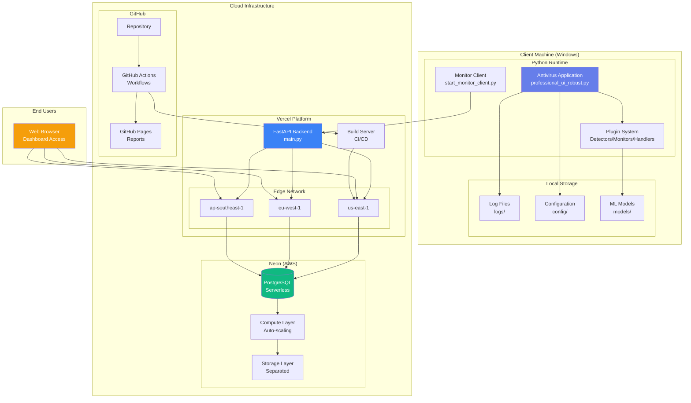
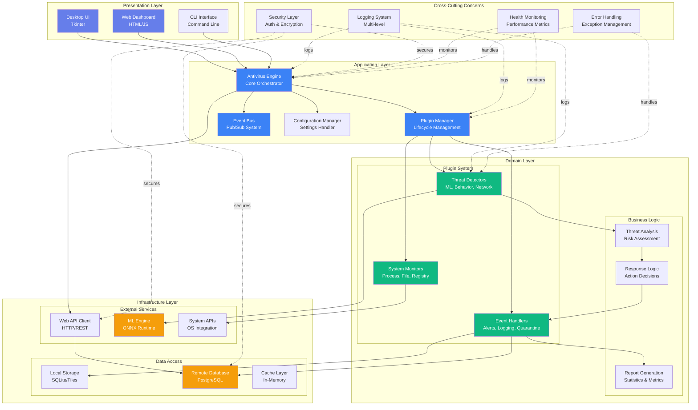
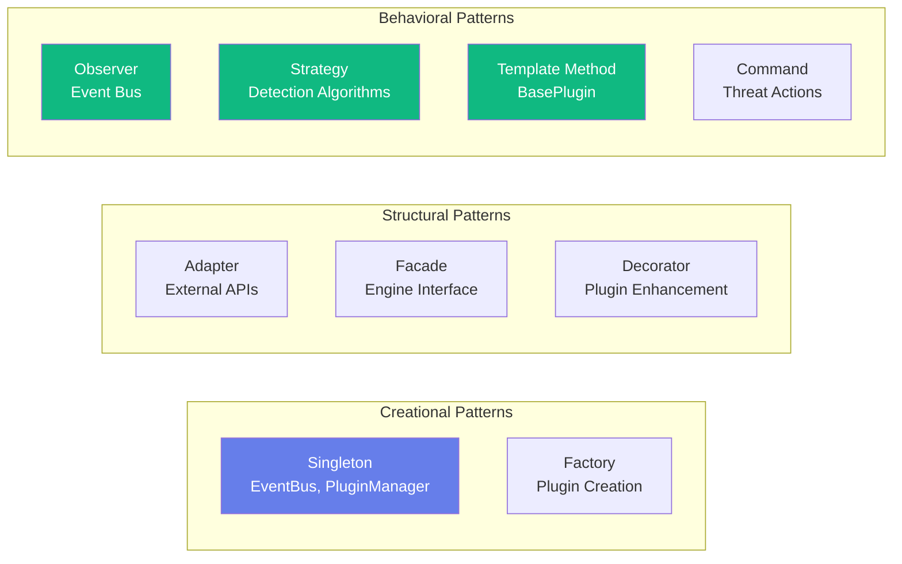

# Diagramas del Sistema - Unified Shield

> **Documentación Visual Completa**  
> Formato: Mermaid  
> Fecha: Diciembre 2025

---

## 📋 Tabla de Contenidos

1. [Diagrama de Casos de Uso](#diagrama-de-casos-de-uso)
2. [Diagrama de Secuencia](#diagrama-de-secuencia)
3. [Diagrama de Clases](#diagrama-de-clases)
4. [Diagrama de Componentes](#diagrama-de-componentes)
5. [Diagrama de Despliegue](#diagrama-de-despliegue)
6. [Diagrama de Arquitectura](#diagrama-de-arquitectura)

---

## Diagrama de Casos de Uso

---

## Diagrama de Secuencia

### Flujo de Detección de Amenazas

### Flujo de Logs Remotos

---

## Diagrama de Clases

---

## Diagrama de Componentes

---

## Diagrama de Despliegue

---

## Diagrama de Arquitectura

### Arquitectura en Capas

### Patrones de Diseño Implementados

---

## Notas de Implementación

### Tecnologías Utilizadas

| Capa | Tecnologías |
|------|-------------|
| **Frontend** | Tkinter, HTML5, CSS3, JavaScript, Chart.js |
| **Backend** | Python 3.8+, FastAPI, SQLAlchemy |
| **Database** | PostgreSQL (Neon), SQLite (local) |
| **ML** | ONNX Runtime, scikit-learn |
| **Deployment** | Vercel, GitHub Actions |
| **Monitoring** | Custom logging, Web dashboard |

### Principios de Diseño

- **SOLID Principles**: Aplicados en toda la arquitectura
- **DRY (Don't Repeat Yourself)**: Código reutilizable
- **KISS (Keep It Simple, Stupid)**: Simplicidad en diseño
- **Separation of Concerns**: Capas bien definidas
- **Dependency Injection**: Desacoplamiento de componentes

---

**Fin del Documento**

*Estos diagramas proporcionan una visión completa de la arquitectura, componentes, flujos de datos y patrones de diseño del sistema Unified Shield.*
