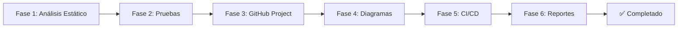
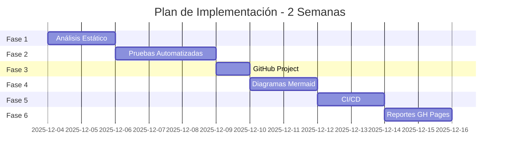

# Plan de Calidad y Automatización - UNIFIED ANTIVIRUS

> **Plan de Implementación Completo**  
> Versión: 1.0  
> Fecha: Diciembre 2025  
> Sistema: Unified Shield Anti-Keylogger Professional

---

## 📋 Tabla de Contenidos

1. [Resumen Ejecutivo](#resumen-ejecutivo)
2. [Objetivos y Alcance](#objetivos-y-alcance)
3. [Checklist de Requisitos](#checklist-de-requisitos)
4. [Plan de Implementación](#plan-de-implementación)
5. [Fase 1: Análisis Estático](#fase-1-análisis-estático)
6. [Fase 2: Pruebas Automatizadas](#fase-2-pruebas-automatizadas)
7. [Fase 3: Gestión de Proyecto](#fase-3-gestión-de-proyecto)
8. [Fase 4: Diagramas Técnicos](#fase-4-diagramas-técnicos)
9. [Fase 5: CI/CD y Automatización](#fase-5-cicd-y-automatización)
10. [Fase 6: Reportes y Visualización](#fase-6-reportes-y-visualización)
11. [Cronograma](#cronograma)

---

## Resumen Ejecutivo

Este plan establece la ruta completa para implementar un sistema de calidad y automatización de nivel profesional para el proyecto UNIFIED ANTIVIRUS, cumpliendo con todos los requisitos de evaluación.

### Puntuación Objetivo

| Categoría | Puntos Máximos | Estado Actual | Objetivo |
|-----------|----------------|---------------|----------|
| Análisis Estático | 1.5 | 0 | 1.5 ✅ |
| Pruebas Automatizadas | 1.5 | 0 | 1.5 ✅ |
| Tareas GitHub Project | 1.0 | 0 | 1.0 ✅ |
| Contribuciones GitHub | 1.0 | 0 | 1.0 ✅ |
| Diagramas Mermaid | 1.0 | 0 | 1.0 ✅ |
| Flujo CI/CD | 1.0 | 0 | 1.0 ✅ |
| Reportes Semgrep/Snyk | 1.0 | 0 | 1.0 ✅ |
| SonarCloud | 1.0 | 0 | 1.0 ✅ |
| Cobertura de Pruebas | 1.0 | 0 | 1.0 ✅ |
| Mutaciones | 1.0 | 0 | 1.0 ✅ |
| BDD | 1.0 | 0 | 1.0 ✅ |
| **TOTAL** | **12.0** | **0** | **12.0** |

---

## Objetivos y Alcance

### Objetivos Principales

1. ✅ **Calidad de Código**: Implementar análisis estático con múltiples herramientas
2. ✅ **Cobertura de Pruebas**: Alcanzar >80% de cobertura con pruebas completas
3. ✅ **Automatización**: Pipeline CI/CD completamente automatizado
4. ✅ **Documentación**: Diagramas técnicos completos en Mermaid
5. ✅ **Visibilidad**: Reportes públicos en GitHub Pages
6. ✅ **Gestión**: Proyecto GitHub con tareas y contribuciones

### Alcance

- **Incluye**: Todo el código Python del proyecto
- **Herramientas**: SonarCloud, Semgrep, Snyk, pytest, mutmut, behave
- **Plataforma**: GitHub Actions + GitHub Pages
- **Documentación**: Diagramas UML en Mermaid

---

## Checklist de Requisitos

### ✅ Análisis Estático (1.5 puntos)

- [ ] **SonarCloud** configurado y ejecutándose
  - [ ] Proyecto creado en SonarCloud
  - [ ] Token configurado en GitHub Secrets
  - [ ] Análisis en cada push/PR
  - [ ] Badge en README
  
- [ ] **Semgrep** configurado
  - [ ] Reglas de seguridad Python
  - [ ] Escaneo automático
  - [ ] Reporte en GH Pages
  
- [ ] **Snyk** configurado
  - [ ] Análisis de dependencias
  - [ ] Detección de vulnerabilidades
  - [ ] Reporte en GH Pages

- [ ] **Informe consolidado** generado
  - [ ] Documento MD con hallazgos
  - [ ] Métricas de calidad
  - [ ] Recomendaciones

---

### ✅ Pruebas Automatizadas (1.5 puntos)

- [ ] **Pruebas Unitarias** (pytest)
  - [ ] Cobertura >80%
  - [ ] Tests para core/
  - [ ] Tests para plugins/
  - [ ] Tests para utils/
  
- [ ] **Pruebas de Mutación** (mutmut)
  - [ ] Configuración mutmut
  - [ ] Score de mutación >70%
  - [ ] Reporte HTML
  
- [ ] **Pruebas de Integración**
  - [ ] Tests de flujo completo
  - [ ] Tests de Event Bus
  - [ ] Tests de Plugin Manager
  
- [ ] **Pruebas de Interfaz** (pytest-qt o selenium)
  - [ ] Tests de UI principal
  - [ ] Tests de interacciones
  
- [ ] **Pruebas BDD** (behave)
  - [ ] Features escritas
  - [ ] Steps implementados
  - [ ] Reporte HTML

- [ ] **Informe de pruebas** completo
  - [ ] Documento consolidado
  - [ ] Métricas de cada tipo
  - [ ] Evidencias

---

### ✅ GitHub Project (1.0 puntos)

- [ ] **Proyecto creado** en GitHub
  - [ ] Tablero Kanban
  - [ ] Columnas: Backlog, To Do, In Progress, Done
  
- [ ] **Tareas creadas** y organizadas
  - [ ] Issues para cada fase
  - [ ] Labels apropiados
  - [ ] Asignaciones
  
- [ ] **Tareas resueltas** documentadas
  - [ ] Commits referenciando issues
  - [ ] Pull requests vinculados
  - [ ] Cierre de issues

---

### ✅ Contribuciones GitHub (1.0 puntos)

- [ ] **Commits significativos**
  - [ ] Mensajes descriptivos
  - [ ] Commits atómicos
  - [ ] Historial limpio
  
- [ ] **Pull Requests**
  - [ ] PRs con descripción
  - [ ] Code reviews
  - [ ] Merges documentados
  
- [ ] **Actividad consistente**
  - [ ] Contribuciones regulares
  - [ ] Gráfico de contribuciones activo

---

### ✅ Diagramas Mermaid (1.0 puntos)

- [ ] **Diagrama de Casos de Uso**
  - [ ] Actores identificados
  - [ ] Casos principales
  - [ ] Relaciones
  
- [ ] **Diagrama de Secuencia**
  - [ ] Flujo de detección
  - [ ] Interacciones entre componentes
  
- [ ] **Diagrama de Clases**
  - [ ] Clases principales
  - [ ] Relaciones y herencia
  - [ ] Atributos y métodos
  
- [ ] **Diagrama de Componentes**
  - [ ] Módulos del sistema
  - [ ] Dependencias
  
- [ ] **Diagrama de Despliegue**
  - [ ] Nodos de ejecución
  - [ ] Distribución de componentes
  
- [ ] **Diagrama de Arquitectura**
  - [ ] Capas del sistema
  - [ ] Flujo de datos
  - [ ] Patrones de diseño

---

### ✅ CI/CD (1.0 puntos)

- [ ] **Workflow único** en GitHub Actions
  - [ ] Trigger en push/PR
  - [ ] Jobs paralelos
  - [ ] Matriz de versiones Python
  
- [ ] **Análisis estático** integrado
  - [ ] SonarCloud
  - [ ] Semgrep
  - [ ] Snyk
  
- [ ] **Pruebas automatizadas** integradas
  - [ ] Unitarias
  - [ ] Integración
  - [ ] Mutaciones
  - [ ] BDD
  
- [ ] **Reportes generados** automáticamente
  - [ ] Cobertura
  - [ ] Mutaciones
  - [ ] BDD
  - [ ] Análisis estático

---

### ✅ Reportes en GitHub Pages (4.0 puntos)

- [ ] **GitHub Pages** habilitado
  - [ ] Branch gh-pages creado
  - [ ] Sitio publicado
  
- [ ] **Reporte Semgrep** publicado
  - [ ] HTML generado
  - [ ] Actualización automática
  
- [ ] **Reporte Snyk** publicado
  - [ ] HTML/JSON generado
  - [ ] Actualización automática
  
- [ ] **Reporte de Cobertura** publicado
  - [ ] HTML coverage report
  - [ ] Badge en README
  - [ ] Anotaciones en Actions
  
- [ ] **Reporte de Mutaciones** publicado
  - [ ] HTML mutmut report
  - [ ] Métricas visibles
  - [ ] Anotaciones en Actions
  
- [ ] **Reporte BDD** publicado
  - [ ] HTML behave report
  - [ ] Features documentadas
  - [ ] Anotaciones en Actions

---

## Plan de Implementación

### Estrategia General

Implementaremos el plan en **6 fases secuenciales**, cada una con entregables específicos:



---

## Fase 1: Análisis Estático

### Objetivo
Configurar y ejecutar herramientas de análisis estático de código.

### Tareas

#### 1.1 Configurar SonarCloud

**Pasos**:

1. Crear cuenta en [SonarCloud.io](https://sonarcloud.io)
2. Importar repositorio desde GitHub
3. Generar token de autenticación
4. Configurar GitHub Secret `SONAR_TOKEN`
5. Crear archivo `sonar-project.properties`

**Archivo**: `sonar-project.properties`
```properties
sonar.projectKey=KrCrimson_ANTIVIRUS_CPP_PROFESSIONAL
sonar.organization=krcrimson

sonar.projectName=Unified Shield Antivirus
sonar.projectVersion=1.0

sonar.sources=core,plugins,utils,web_backend
sonar.tests=tests
sonar.python.coverage.reportPaths=coverage.xml
sonar.python.version=3.8,3.9,3.10,3.11

sonar.exclusions=**/tests/**,**/build/**,**/dist/**,**/__pycache__/**
```

**Entregable**: ✅ SonarCloud configurado y ejecutándose

---

#### 1.2 Configurar Semgrep

**Pasos**:

1. Crear archivo `.semgrep.yml` con reglas
2. Configurar escaneo en workflow
3. Generar reporte HTML

**Archivo**: `.semgrep.yml`
```yaml
rules:
  - id: python-security-audit
    patterns:
      - pattern: eval(...)
    message: "Uso de eval() detectado - riesgo de seguridad"
    severity: ERROR
    languages: [python]
    
  - id: sql-injection
    patterns:
      - pattern: execute($SQL)
    message: "Posible SQL injection"
    severity: ERROR
    languages: [python]
```

**Comando**:
```bash
semgrep --config=auto --json --output=semgrep-report.json .
semgrep --config=auto --sarif --output=semgrep-report.sarif .
```

**Entregable**: ✅ Semgrep configurado con reglas de seguridad

---

#### 1.3 Configurar Snyk

**Pasos**:

1. Crear cuenta en [Snyk.io](https://snyk.io)
2. Generar token API
3. Configurar GitHub Secret `SNYK_TOKEN`
4. Escanear dependencias

**Comandos**:
```bash
pip install snyk
snyk auth $SNYK_TOKEN
snyk test --json --json-file-output=snyk-report.json
snyk monitor
```

**Entregable**: ✅ Snyk configurado para análisis de dependencias

---

#### 1.4 Generar Informe Consolidado

**Estructura del informe**:

```markdown
# Informe de Análisis Estático

## Resumen Ejecutivo
- Total de issues: X
- Críticos: X
- Altos: X
- Medios: X
- Bajos: X

## SonarCloud
### Métricas
- Code Smells: X
- Bugs: X
- Vulnerabilidades: X
- Deuda técnica: X horas
- Cobertura: X%
- Duplicación: X%

## Semgrep
### Hallazgos de Seguridad
[Lista de hallazgos]

## Snyk
### Vulnerabilidades en Dependencias
[Lista de vulnerabilidades]

## Recomendaciones
[Acciones prioritarias]
```

**Entregable**: ✅ Informe `ANALISIS_ESTATICO.md` completo

---

## Fase 2: Pruebas Automatizadas

### Objetivo
Implementar suite completa de pruebas automatizadas.

### Tareas

#### 2.1 Pruebas Unitarias con pytest

**Estructura de tests**:
```
tests/
├── unit/
│   ├── test_event_bus.py
│   ├── test_plugin_manager.py
│   ├── test_base_plugin.py
│   ├── test_interfaces.py
│   └── test_detectors.py
├── conftest.py
└── pytest.ini
```

**Archivo**: `pytest.ini`
```ini
[pytest]
testpaths = tests
python_files = test_*.py
python_classes = Test*
python_functions = test_*
addopts = 
    --verbose
    --cov=core
    --cov=plugins
    --cov=utils
    --cov-report=html
    --cov-report=xml
    --cov-report=term-missing
    --cov-fail-under=80
```

**Ejemplo de test**:
```python
# tests/unit/test_event_bus.py
import pytest
from core.event_bus import EventBus, Event

class TestEventBus:
    def test_publish_event(self):
        bus = EventBus()
        event_received = []
        
        def callback(event):
            event_received.append(event)
        
        bus.subscribe("test_event", callback, "test_subscriber")
        bus.publish("test_event", {"data": "test"}, "test_source")
        
        assert len(event_received) == 1
        assert event_received[0].event_type == "test_event"
```

**Comandos**:
```bash
pytest tests/unit/ -v --cov
pytest tests/unit/ --cov-report=html
```

**Entregable**: ✅ Suite de pruebas unitarias con >80% cobertura

---

#### 2.2 Pruebas de Mutación con mutmut

**Configuración**: `.mutmut.yml`
```yaml
paths_to_mutate:
  - core/
  - plugins/
  - utils/

tests_dir: tests/

runner: pytest

dict_synonyms:
  - id
  - name
```

**Comandos**:
```bash
pip install mutmut
mutmut run
mutmut results
mutmut html
```

**Entregable**: ✅ Reporte de mutaciones con score >70%

---

#### 2.3 Pruebas de Integración

**Estructura**:
```
tests/
└── integration/
    ├── test_plugin_lifecycle.py
    ├── test_detection_flow.py
    └── test_event_propagation.py
```

**Ejemplo**:
```python
# tests/integration/test_detection_flow.py
def test_complete_detection_flow():
    """Test del flujo completo de detección"""
    # Arrange
    engine = UnifiedAntivirusEngine()
    detector = MLDetector()
    handler = ThreatHandler()
    
    # Act
    engine.register_plugin(detector)
    engine.register_plugin(handler)
    engine.start()
    
    # Simulate threat
    threat_data = create_test_threat()
    
    # Assert
    assert detector.detect_threats(threat_data)
    assert handler.threats_handled > 0
```

**Entregable**: ✅ Suite de pruebas de integración

---

#### 2.4 Pruebas de Interfaz

**Para Tkinter UI**:
```python
# tests/ui/test_main_window.py
import pytest
from professional_ui_robust import RobustAntivirusUI

def test_main_window_creation():
    """Test creación de ventana principal"""
    app = RobustAntivirusUI()
    assert app.root is not None
    assert app.root.title() == "Unified Shield - Professional Antivirus"
```

**Entregable**: ✅ Tests de interfaz de usuario

---

#### 2.5 Pruebas BDD con behave

**Estructura**:
```
tests/
└── bdd/
    ├── features/
    │   ├── threat_detection.feature
    │   ├── plugin_management.feature
    │   └── event_handling.feature
    └── steps/
        ├── threat_steps.py
        └── plugin_steps.py
```

**Ejemplo**: `features/threat_detection.feature`
```gherkin
Feature: Detección de Amenazas
  Como usuario del antivirus
  Quiero que el sistema detecte amenazas
  Para proteger mi sistema

  Scenario: Detectar keylogger con ML
    Given el sistema está iniciado
    And el detector ML está activo
    When se ejecuta un proceso sospechoso con hooks de teclado
    Then el sistema debe detectar una amenaza de tipo "keylogger"
    And la severidad debe ser "CRITICAL"
    And la confianza debe ser mayor a 0.7
```

**Steps**: `steps/threat_steps.py`
```python
from behave import given, when, then

@given('el sistema está iniciado')
def step_impl(context):
    context.engine = UnifiedAntivirusEngine()
    context.engine.start()

@when('se ejecuta un proceso sospechoso con hooks de teclado')
def step_impl(context):
    context.threat_data = {
        "process": "suspicious.exe",
        "hooks": ["WH_KEYBOARD_LL"]
    }
    context.result = context.engine.analyze(context.threat_data)

@then('el sistema debe detectar una amenaza de tipo "{threat_type}"')
def step_impl(context, threat_type):
    assert context.result['threat_type'] == threat_type
```

**Comandos**:
```bash
behave tests/bdd/features/ --format=html --outfile=behave-report.html
```

**Entregable**: ✅ Suite BDD completa con reportes

---

#### 2.6 Informe de Pruebas Consolidado

**Estructura**:
```markdown
# Informe de Pruebas Automatizadas

## Resumen Ejecutivo
- Total de tests: X
- Pasados: X
- Fallidos: X
- Cobertura: X%
- Score de mutación: X%

## Pruebas Unitarias
### Estadísticas
- Tests ejecutados: X
- Cobertura por módulo:
  - core/: X%
  - plugins/: X%
  - utils/: X%

## Pruebas de Mutación
### Resultados
- Mutantes generados: X
- Mutantes eliminados: X
- Score: X%

## Pruebas de Integración
[Resultados]

## Pruebas de Interfaz
[Resultados]

## Pruebas BDD
### Features
[Lista de features y escenarios]

## Conclusiones
[Análisis de calidad]
```

**Entregable**: ✅ Informe `REPORTE_PRUEBAS.md` completo

---

## Fase 3: Gestión de Proyecto

### Objetivo
Configurar GitHub Project con tareas y contribuciones.

### Tareas

#### 3.1 Crear GitHub Project

**Pasos**:
1. Ir a repositorio → Projects → New Project
2. Seleccionar template "Board"
3. Nombrar: "Unified Shield - Quality & Automation"
4. Crear columnas:
   - 📋 Backlog
   - 📝 To Do
   - 🚧 In Progress
   - ✅ Done

**Entregable**: ✅ Proyecto GitHub creado

---

#### 3.2 Crear Issues para Cada Fase

**Template de Issue**:
```markdown
## Descripción
[Descripción de la tarea]

## Objetivos
- [ ] Objetivo 1
- [ ] Objetivo 2

## Criterios de Aceptación
- [ ] Criterio 1
- [ ] Criterio 2

## Entregables
- [ ] Entregable 1

## Estimación
X horas

## Labels
`enhancement`, `testing`, `ci-cd`
```

**Issues a crear**:
1. Configurar SonarCloud
2. Configurar Semgrep
3. Configurar Snyk
4. Implementar pruebas unitarias
5. Implementar pruebas de mutación
6. Implementar pruebas BDD
7. Crear diagramas Mermaid
8. Configurar CI/CD
9. Publicar reportes en GH Pages

**Entregable**: ✅ Issues creados y organizados

---

#### 3.3 Workflow de Contribuciones

**Proceso**:
1. Crear branch para cada issue: `feature/issue-X-descripcion`
2. Commits referenciando issue: `feat: implementar X (#123)`
3. Pull Request con template
4. Code review
5. Merge y cierre de issue

**Template de PR**:
```markdown
## Descripción
Cierra #123

## Cambios
- Cambio 1
- Cambio 2

## Checklist
- [ ] Tests agregados
- [ ] Documentación actualizada
- [ ] CI passing
```

**Entregable**: ✅ Workflow de contribuciones establecido

---

## Fase 4: Diagramas Técnicos

### Objetivo
Crear todos los diagramas UML en formato Mermaid.

### Tareas

#### 4.1 Diagrama de Casos de Uso

**Archivo**: `docs/diagrams/use-cases.md`

```markdown
# Diagrama de Casos de Uso

\`\`\`mermaid
graph TB
    User((Usuario))
    Admin((Administrador))
    System((Sistema))
    
    User --> UC1[Iniciar Protección]
    User --> UC2[Ver Dashboard]
    User --> UC3[Revisar Alertas]
    User --> UC4[Escanear Sistema]
    
    Admin --> UC5[Configurar Plugins]
    Admin --> UC6[Ver Logs]
    Admin --> UC7[Gestionar Cuarentena]
    
    System --> UC8[Detectar Amenazas]
    System --> UC9[Monitorear Procesos]
    System --> UC10[Enviar Logs]
\`\`\`
```

**Entregable**: ✅ Diagrama de casos de uso

---

#### 4.2 Diagrama de Secuencia

**Archivo**: `docs/diagrams/sequence.md`

```markdown
# Diagrama de Secuencia - Detección de Amenaza

\`\`\`mermaid
sequenceDiagram
    participant U as Usuario
    participant UI as Interfaz
    participant E as Engine
    participant D as Detector
    participant EB as EventBus
    participant H as Handler
    
    U->>UI: Iniciar protección
    UI->>E: start_protection()
    E->>D: activate()
    D->>D: start_monitoring()
    
    loop Monitoreo continuo
        D->>D: get_system_data()
        D->>D: detect_threats(data)
        alt Amenaza detectada
            D->>EB: publish("threat_detected", threat_info)
            EB->>H: notify(threat_info)
            EB->>UI: notify(threat_info)
            H->>H: handle_threat()
            UI->>U: Mostrar alerta
        end
    end
\`\`\`
```

**Entregable**: ✅ Diagrama de secuencia

---

#### 4.3 Diagrama de Clases

**Archivo**: `docs/diagrams/classes.md`

```markdown
# Diagrama de Clases

\`\`\`mermaid
classDiagram
    class BasePlugin {
        <<abstract>>
        +plugin_name: str
        +config: dict
        +is_running: bool
        +activate() bool
        +deactivate() bool
        +initialize()* bool
        +start()* bool
        +stop()* bool
    }
    
    class DetectorInterface {
        <<interface>>
        +detect_threats(data) List
        +get_confidence_score() float
        +update_signatures() bool
    }
    
    class MLDetector {
        -model: ONNXModel
        -threshold: float
        +detect_threats(data) List
        +load_model() bool
    }
    
    class EventBus {
        -subscribers: dict
        -event_history: list
        +subscribe(event_type, callback) bool
        +publish(event_type, data) bool
    }
    
    class PluginManager {
        -plugins: dict
        -event_bus: EventBus
        +register_plugin(plugin) bool
        +load_plugins() bool
    }
    
    BasePlugin <|-- MLDetector
    DetectorInterface <|.. MLDetector
    PluginManager --> BasePlugin
    PluginManager --> EventBus
\`\`\`
```

**Entregable**: ✅ Diagrama de clases

---

#### 4.4 Diagrama de Componentes

**Archivo**: `docs/diagrams/components.md`

```markdown
# Diagrama de Componentes

\`\`\`mermaid
graph TB
    subgraph "Frontend Layer"
        UI[UI Component<br/>Tkinter]
    end
    
    subgraph "Core Layer"
        Engine[Engine<br/>Core]
        EB[Event Bus<br/>Observer]
        PM[Plugin Manager<br/>Registry]
    end
    
    subgraph "Plugin Layer"
        D1[ML Detector]
        D2[Behavior Detector]
        H1[Threat Handler]
        M1[Process Monitor]
    end
    
    subgraph "Data Layer"
        DB[(PostgreSQL<br/>Database)]
        Logs[Log Files]
        Models[ML Models]
    end
    
    UI --> Engine
    Engine --> EB
    Engine --> PM
    PM --> D1
    PM --> D2
    PM --> H1
    PM --> M1
    D1 --> Models
    Engine --> DB
    Engine --> Logs
\`\`\`
```

**Entregable**: ✅ Diagrama de componentes

---

#### 4.5 Diagrama de Despliegue

**Archivo**: `docs/diagrams/deployment.md`

```markdown
# Diagrama de Despliegue

\`\`\`mermaid
graph TB
    subgraph "Client Machine"
        subgraph "Windows OS"
            App[Antivirus Application<br/>Python 3.8+]
            UI[Tkinter UI]
            Logs[Local Logs]
        end
    end
    
    subgraph "Cloud Infrastructure"
        subgraph "Vercel"
            API[Web Backend<br/>FastAPI]
        end
        
        subgraph "Railway/Neon"
            DB[(PostgreSQL<br/>Database)]
        end
        
        subgraph "GitHub Pages"
            Reports[Reports<br/>HTML/CSS]
        end
    end
    
    App -->|HTTPS| API
    API -->|SQL| DB
    App -->|Upload Logs| API
    API -->|Store| DB
    Reports -->|View| User((User))
\`\`\`
```

**Entregable**: ✅ Diagrama de despliegue

---

#### 4.6 Diagrama de Arquitectura

**Archivo**: `docs/diagrams/architecture.md`

```markdown
# Diagrama de Arquitectura

\`\`\`mermaid
graph TB
    subgraph "Presentation Layer"
        UI[User Interface<br/>Tkinter/Web]
    end
    
    subgraph "Application Layer"
        Engine[Antivirus Engine]
        PM[Plugin Manager]
        EB[Event Bus]
    end
    
    subgraph "Domain Layer"
        Plugins[Plugin System]
        Detectors[Detectors]
        Monitors[Monitors]
        Handlers[Handlers]
    end
    
    subgraph "Infrastructure Layer"
        DB[Database Access]
        FS[File System]
        Net[Network]
        ML[ML Models]
    end
    
    subgraph "Cross-Cutting Concerns"
        Log[Logging]
        Sec[Security]
        Config[Configuration]
    end
    
    UI --> Engine
    Engine --> PM
    Engine --> EB
    PM --> Plugins
    Plugins --> Detectors
    Plugins --> Monitors
    Plugins --> Handlers
    Detectors --> ML
    Monitors --> FS
    Handlers --> DB
    
    Log -.-> Engine
    Sec -.-> Engine
    Config -.-> PM
\`\`\`
```

**Entregable**: ✅ Diagrama de arquitectura

---

## Fase 5: CI/CD y Automatización

### Objetivo
Crear workflow único de GitHub Actions para todas las pruebas.

### Tareas

#### 5.1 Workflow Principal

**Archivo**: `.github/workflows/quality-pipeline.yml`

```yaml
name: Quality & Testing Pipeline

on:
  push:
    branches: [ main, develop ]
  pull_request:
    branches: [ main, develop ]

jobs:
  static-analysis:
    name: Static Analysis
    runs-on: ubuntu-latest
    
    steps:
      - uses: actions/checkout@v3
        with:
          fetch-depth: 0
      
      - name: Set up Python
        uses: actions/setup-python@v4
        with:
          python-version: '3.10'
      
      - name: Install dependencies
        run: |
          pip install -r requirements.txt
          pip install semgrep snyk
      
      - name: Run Semgrep
        run: |
          semgrep --config=auto --json --output=semgrep-report.json .
          semgrep --config=auto --sarif --output=semgrep-report.sarif .
      
      - name: Run Snyk
        env:
          SNYK_TOKEN: ${{ secrets.SNYK_TOKEN }}
        run: |
          snyk test --json --json-file-output=snyk-report.json || true
      
      - name: SonarCloud Scan
        uses: SonarSource/sonarcloud-github-action@master
        env:
          GITHUB_TOKEN: ${{ secrets.GITHUB_TOKEN }}
          SONAR_TOKEN: ${{ secrets.SONAR_TOKEN }}
      
      - name: Upload reports
        uses: actions/upload-artifact@v3
        with:
          name: static-analysis-reports
          path: |
            semgrep-report.*
            snyk-report.json

  unit-tests:
    name: Unit Tests
    runs-on: ubuntu-latest
    strategy:
      matrix:
        python-version: ['3.8', '3.9', '3.10', '3.11']
    
    steps:
      - uses: actions/checkout@v3
      
      - name: Set up Python ${{ matrix.python-version }}
        uses: actions/setup-python@v4
        with:
          python-version: ${{ matrix.python-version }}
      
      - name: Install dependencies
        run: |
          pip install -r requirements.txt
          pip install pytest pytest-cov pytest-html
      
      - name: Run unit tests
        run: |
          pytest tests/unit/ \
            --cov=core \
            --cov=plugins \
            --cov=utils \
            --cov-report=xml \
            --cov-report=html \
            --cov-report=term-missing \
            --html=pytest-report.html \
            --self-contained-html
      
      - name: Upload coverage to Codecov
        uses: codecov/codecov-action@v3
        with:
          file: ./coverage.xml
          flags: unittests
      
      - name: Coverage annotation
        run: |
          coverage report --format=markdown >> $GITHUB_STEP_SUMMARY
      
      - name: Upload test reports
        uses: actions/upload-artifact@v3
        with:
          name: test-reports-${{ matrix.python-version }}
          path: |
            coverage.xml
            htmlcov/
            pytest-report.html

  mutation-tests:
    name: Mutation Testing
    runs-on: ubuntu-latest
    needs: unit-tests
    
    steps:
      - uses: actions/checkout@v3
      
      - name: Set up Python
        uses: actions/setup-python@v4
        with:
          python-version: '3.10'
      
      - name: Install dependencies
        run: |
          pip install -r requirements.txt
          pip install mutmut
      
      - name: Run mutation tests
        run: |
          mutmut run --paths-to-mutate=core/,plugins/,utils/
          mutmut results
          mutmut html
      
      - name: Mutation score annotation
        run: |
          echo "## Mutation Testing Results" >> $GITHUB_STEP_SUMMARY
          mutmut results >> $GITHUB_STEP_SUMMARY
      
      - name: Upload mutation report
        uses: actions/upload-artifact@v3
        with:
          name: mutation-report
          path: html/

  integration-tests:
    name: Integration Tests
    runs-on: ubuntu-latest
    
    steps:
      - uses: actions/checkout@v3
      
      - name: Set up Python
        uses: actions/setup-python@v4
        with:
          python-version: '3.10'
      
      - name: Install dependencies
        run: |
          pip install -r requirements.txt
          pip install pytest
      
      - name: Run integration tests
        run: |
          pytest tests/integration/ -v

  bdd-tests:
    name: BDD Tests
    runs-on: ubuntu-latest
    
    steps:
      - uses: actions/checkout@v3
      
      - name: Set up Python
        uses: actions/setup-python@v4
        with:
          python-version: '3.10'
      
      - name: Install dependencies
        run: |
          pip install -r requirements.txt
          pip install behave
      
      - name: Run BDD tests
        run: |
          behave tests/bdd/features/ \
            --format=html \
            --outfile=behave-report.html \
            --format=json \
            --outfile=behave-report.json
      
      - name: BDD results annotation
        run: |
          echo "## BDD Test Results" >> $GITHUB_STEP_SUMMARY
          cat behave-report.json | jq '.[] | .status' >> $GITHUB_STEP_SUMMARY
      
      - name: Upload BDD report
        uses: actions/upload-artifact@v3
        with:
          name: bdd-report
          path: behave-report.*

  publish-reports:
    name: Publish Reports to GitHub Pages
    runs-on: ubuntu-latest
    needs: [static-analysis, unit-tests, mutation-tests, bdd-tests]
    if: github.ref == 'refs/heads/main'
    
    steps:
      - uses: actions/checkout@v3
      
      - name: Download all artifacts
        uses: actions/download-artifact@v3
      
      - name: Prepare GitHub Pages
        run: |
          mkdir -p gh-pages
          cp -r htmlcov gh-pages/coverage
          cp -r html gh-pages/mutations
          cp behave-report.html gh-pages/bdd.html
          cp semgrep-report.json gh-pages/semgrep.json
          cp snyk-report.json gh-pages/snyk.json
          
          # Create index.html
          cat > gh-pages/index.html << 'EOF'
          <!DOCTYPE html>
          <html>
          <head>
            <title>Unified Shield - Quality Reports</title>
          </head>
          <body>
            <h1>Quality & Testing Reports</h1>
            <ul>
              <li><a href="coverage/index.html">Coverage Report</a></li>
              <li><a href="mutations/index.html">Mutation Testing</a></li>
              <li><a href="bdd.html">BDD Report</a></li>
              <li><a href="semgrep.json">Semgrep Results</a></li>
              <li><a href="snyk.json">Snyk Results</a></li>
            </ul>
          </body>
          </html>
          EOF
      
      - name: Deploy to GitHub Pages
        uses: peaceiris/actions-gh-pages@v3
        with:
          github_token: ${{ secrets.GITHUB_TOKEN }}
          publish_dir: ./gh-pages
```

**Entregable**: ✅ Workflow CI/CD completo

---

## Fase 6: Reportes y Visualización

### Objetivo
Publicar todos los reportes en GitHub Pages.

### Tareas

#### 6.1 Configurar GitHub Pages

**Pasos**:
1. Settings → Pages
2. Source: Deploy from a branch
3. Branch: gh-pages
4. Folder: / (root)
5. Save

**Entregable**: ✅ GitHub Pages habilitado

---

#### 6.2 Crear Página Index

**Archivo**: `gh-pages/index.html`

```html
<!DOCTYPE html>
<html lang="es">
<head>
    <meta charset="UTF-8">
    <meta name="viewport" content="width=device-width, initial-scale=1.0">
    <title>Unified Shield - Quality Dashboard</title>
    <style>
        * { margin: 0; padding: 0; box-sizing: border-box; }
        body {
            font-family: 'Segoe UI', Tahoma, Geneva, Verdana, sans-serif;
            background: linear-gradient(135deg, #667eea 0%, #764ba2 100%);
            min-height: 100vh;
            padding: 2rem;
        }
        .container {
            max-width: 1200px;
            margin: 0 auto;
        }
        h1 {
            color: white;
            text-align: center;
            margin-bottom: 2rem;
            font-size: 2.5rem;
        }
        .grid {
            display: grid;
            grid-template-columns: repeat(auto-fit, minmax(300px, 1fr));
            gap: 1.5rem;
        }
        .card {
            background: white;
            border-radius: 12px;
            padding: 2rem;
            box-shadow: 0 10px 30px rgba(0,0,0,0.2);
            transition: transform 0.3s;
        }
        .card:hover {
            transform: translateY(-5px);
        }
        .card h2 {
            color: #667eea;
            margin-bottom: 1rem;
        }
        .card p {
            color: #666;
            margin-bottom: 1rem;
        }
        .card a {
            display: inline-block;
            background: #667eea;
            color: white;
            padding: 0.75rem 1.5rem;
            border-radius: 6px;
            text-decoration: none;
            transition: background 0.3s;
        }
        .card a:hover {
            background: #764ba2;
        }
        .badge {
            display: inline-block;
            padding: 0.25rem 0.75rem;
            border-radius: 12px;
            font-size: 0.875rem;
            font-weight: bold;
            margin-bottom: 1rem;
        }
        .badge.success { background: #10b981; color: white; }
        .badge.warning { background: #f59e0b; color: white; }
        .badge.info { background: #3b82f6; color: white; }
    </style>
</head>
<body>
    <div class="container">
        <h1>🛡️ Unified Shield - Quality Dashboard</h1>
        
        <div class="grid">
            <div class="card">
                <span class="badge success">✅ Active</span>
                <h2>📊 Coverage Report</h2>
                <p>Reporte de cobertura de código con pytest-cov</p>
                <a href="coverage/index.html">Ver Reporte →</a>
            </div>
            
            <div class="card">
                <span class="badge success">✅ Active</span>
                <h2>🧬 Mutation Testing</h2>
                <p>Resultados de pruebas de mutación con mutmut</p>
                <a href="mutations/index.html">Ver Reporte →</a>
            </div>
            
            <div class="card">
                <span class="badge success">✅ Active</span>
                <h2>🥒 BDD Report</h2>
                <p>Reporte de pruebas BDD con behave</p>
                <a href="bdd.html">Ver Reporte →</a>
            </div>
            
            <div class="card">
                <span class="badge info">🔍 Security</span>
                <h2>🔒 Semgrep Analysis</h2>
                <p>Análisis de seguridad con Semgrep</p>
                <a href="semgrep.html">Ver Reporte →</a>
            </div>
            
            <div class="card">
                <span class="badge info">🔍 Security</span>
                <h2>🛡️ Snyk Vulnerabilities</h2>
                <p>Análisis de vulnerabilidades en dependencias</p>
                <a href="snyk.html">Ver Reporte →</a>
            </div>
            
            <div class="card">
                <span class="badge warning">📈 Metrics</span>
                <h2>☁️ SonarCloud</h2>
                <p>Análisis completo de calidad de código</p>
                <a href="https://sonarcloud.io/dashboard?id=KrCrimson_ANTIVIRUS_CPP_PROFESSIONAL" target="_blank">Ver Dashboard →</a>
            </div>
        </div>
    </div>
</body>
</html>
```

**Entregable**: ✅ Dashboard de reportes publicado

---

## Cronograma

### Timeline de Implementación



### Distribución de Tiempo

| Fase | Duración | Esfuerzo | Prioridad |
|------|----------|----------|-----------|
| Fase 1: Análisis Estático | 2 días | 16h | Alta |
| Fase 2: Pruebas | 3 días | 24h | Crítica |
| Fase 3: GitHub Project | 1 día | 8h | Media |
| Fase 4: Diagramas | 2 días | 16h | Alta |
| Fase 5: CI/CD | 2 días | 16h | Crítica |
| Fase 6: Reportes | 2 días | 16h | Alta |
| **Total** | **12 días** | **96h** | - |

---

## Próximos Pasos

### Comenzar Implementación

1. ✅ **Revisar este plan** con el equipo
2. ✅ **Crear GitHub Project** y issues
3. ✅ **Comenzar Fase 1**: Análisis Estático
4. ✅ **Seguir secuencialmente** cada fase

### Preguntas Frecuentes

**Q: ¿Podemos paralelizar algunas fases?**  
A: Sí, las Fases 3 y 4 pueden ejecutarse en paralelo con Fase 2.

**Q: ¿Qué pasa si no alcanzamos 80% de cobertura?**  
A: Ajustar el umbral temporalmente y crear issues para mejorar cobertura.

**Q: ¿Necesitamos todas las herramientas?**  
A: Sí, cada herramienta aporta puntos específicos en la evaluación.

---

## Conclusión

Este plan proporciona una ruta clara y detallada para alcanzar **12.0/12.0 puntos** en calidad y automatización. Cada fase está diseñada para ser implementada secuencialmente, con entregables claros y verificables.

**¿Listo para comenzar? Vamos con la Fase 1! 🚀**

---

**Documento creado por**: Antigravity AI  
**Fecha**: Diciembre 2025  
**Versión**: 1.0
