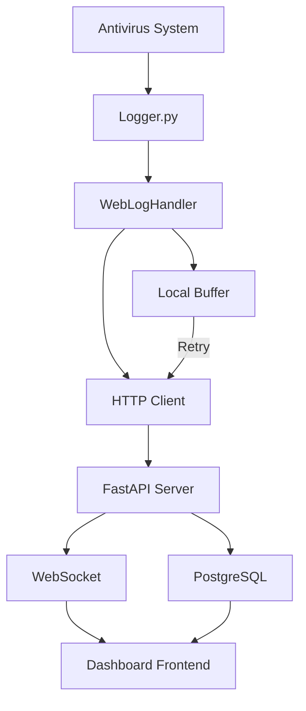

# 📋 PLAN SCRUM - Sistema de Logging Web Centralizado
## Implementación de Envío de Logs del Antivirus a Servidor Web

[](https://scrum.org/)
[](https://fastapi.tiangolo.com/)
[](planning)

### 🎯 **PRODUCT BACKLOG OVERVIEW**

**🔍 Problema**: Los logs del antivirus se guardan solo localmente, dificultando el monitoreo centralizado y análisis en tiempo real.

**💡 Solución**: Sistema web que recibe todos los logs del antivirus en tiempo real, permite visualización, filtrado y análisis centralizado.

**📊 Valor de Negocio**: Monitoreo centralizado, análisis de tendencias, alertas automáticas, compliance y auditoria.

---

## 🚀 **SPRINT PLANNING**

### **📋 SPRINT 0: Análisis y Planificación (ACTUAL)**
**🗓️ Duración**: 2 días  
**👥 Team**: 1 Developer (Full-Stack)  
**🎯 Objetivo**: Definir arquitectura técnica y requerimientos completos

#### **📝 USER STORIES**

##### **US-001**: Como DevOps, quiero entender la arquitectura actual
```gherkin
GIVEN el sistema de logging actual en utils/logger.py
WHEN analizo los componentes existentes
THEN puedo definir la mejor estrategia de integración web
```

##### **US-002**: Como Architect, quiero diseñar la solución técnica
```gherkin
GIVEN los requerimientos de logging web
WHEN diseño la arquitectura del sistema
THEN tengo un plan técnico detallado para implementar
```

#### **✅ TASKS - SPRINT 0**

| Task | Descripción | Estimación | Estado |
|------|-------------|------------|---------|
| T001 | Analizar logger actual (`utils/logger.py`) | 2h | ✅ |
| T002 | Diseñar API REST para recepción de logs | 3h | 🔄 |
| T003 | Seleccionar stack tecnológico (FastAPI + SQLite) | 1h | 🔄 |
| T004 | Definir formato JSON para logs web | 2h | ⏳ |
| T005 | Planificar modificaciones en logger existente | 2h | ⏳ |
| T006 | Crear user stories detalladas para todos sprints | 2h | ⏳ |

---

### **🌟 SPRINT 1: Backend Web API para Logs**
**🗓️ Duración**: 5 días  
**👥 Team**: 1 Backend Developer  
**🎯 Objetivo**: API funcional que recibe y almacena logs del antivirus

#### **📋 SPRINT GOAL**
*"Crear un servidor web que pueda recibir, validar y almacenar todos los logs enviados por el sistema antivirus, con endpoints básicos de consulta"*

#### **📝 USER STORIES - SPRINT 1**

##### **US-101**: Como sistema antivirus, quiero enviar logs a un servidor web
```gherkin
GIVEN el antivirus genera logs en tiempo real
WHEN envío logs via HTTP POST al servidor
THEN los logs se almacenan correctamente en la base de datos
```
**📊 Story Points**: 8  
**✅ Acceptance Criteria**:
- [ ] Endpoint `POST /api/logs` acepta logs JSON
- [ ] Validación de formato de datos obligatoria
- [ ] Almacenamiento en SQLite/PostgreSQL
- [ ] Respuesta HTTP 201 para logs exitosos
- [ ] Manejo de errores con códigos apropiados

##### **US-102**: Como administrador, quiero consultar logs almacenados
```gherkin
GIVEN logs almacenados en el servidor web
WHEN hago consultas via API REST
THEN puedo filtrar por fecha, nivel, componente
```
**📊 Story Points**: 5  
**✅ Acceptance Criteria**:
- [ ] Endpoint `GET /api/logs` con paginación
- [ ] Filtros por: date_from, date_to, level, component
- [ ] Endpoint `GET /api/logs/{id}` para log específico
- [ ] Respuesta JSON estructurada
- [ ] Performance adecuada (<500ms por consulta)

##### **US-103**: Como sistema, quiero autenticación básica para seguridad
```gherkin
GIVEN endpoints sensibles del servidor de logs
WHEN clientes intentan acceder sin autenticación
THEN se rechaza el acceso con error 401
```
**📊 Story Points**: 3  
**✅ Acceptance Criteria**:
- [ ] API Keys para autenticación
- [ ] Header `Authorization: Bearer <token>`
- [ ] Validación en todos los endpoints
- [ ] Rate limiting básico
- [ ] Logs de intentos de acceso no autorizados

#### **🛠️ TECHNICAL TASKS - SPRINT 1**

| Task | Descripción | Estimación | Prioridad |
|------|-------------|------------|-----------|
| T101 | Setup proyecto FastAPI con estructura base | 4h | Alta |
| T102 | Crear modelos de base de datos (SQLAlchemy) | 3h | Alta |
| T103 | Implementar endpoint `POST /api/logs` | 4h | Alta |
| T104 | Implementar endpoint `GET /api/logs` con filtros | 5h | Alta |
| T105 | Setup SQLite/PostgreSQL y migraciones | 2h | Alta |
| T106 | Implementar autenticación con API Keys | 3h | Media |
| T107 | Validación de datos con Pydantic | 2h | Media |
| T108 | Rate limiting y middlewares de seguridad | 2h | Baja |
| T109 | Tests unitarios para endpoints | 4h | Alta |
| T110 | Docker setup para desarrollo | 2h | Baja |

**📈 Total Estimación**: 31h (≈5 días)

---

### **🔧 SPRINT 2: Integración con Logger del Antivirus**
**🗓️ Duración**: 4 días  
**👥 Team**: 1 Backend Developer  
**🎯 Objetivo**: Modificar sistema de logging para envío automático a servidor web

#### **📋 SPRINT GOAL**
*"Extender el sistema de logging actual para enviar automáticamente todos los logs al servidor web, manteniendo compatibilidad con archivos locales"*

#### **📝 USER STORIES - SPRINT 2**

##### **US-201**: Como logger del antivirus, quiero enviar logs automáticamente al servidor
```gherkin
GIVEN el sistema de logging configurado para web
WHEN se genera cualquier log en el antivirus
THEN se envía automáticamente al servidor web sin afectar performance
```
**📊 Story Points**: 13  
**✅ Acceptance Criteria**:
- [ ] WebLogHandler personalizado integrado en Logger
- [ ] Envío asíncrono para no bloquear aplicación principal
- [ ] Buffer local para logs cuando servidor no disponible
- [ ] Configuración vía `logging_config.json`
- [ ] Fallback automático a archivos si web falla

##### **US-202**: Como sistema, quiero reconexión automática cuando servidor vuelve
```gherkin
GIVEN el servidor web no disponible temporalmente
WHEN el servidor vuelve a estar online
THEN los logs buffereados se envían automáticamente
```
**📊 Story Points**: 8  
**✅ Acceptance Criteria**:
- [ ] Detección automática de reconexión
- [ ] Reintento exponential backoff
- [ ] Envío de logs buffereados en orden correcto
- [ ] Máximo de intentos configurable
- [ ] Logs de estado de conexión

##### **US-203**: Como administrador, quiero configurar el comportamiento del logging web
```gherkin
GIVEN archivo de configuración del antivirus
WHEN modifico configuraciones de logging web
THEN el comportamiento cambia sin reiniciar el antivirus
```
**📊 Story Points**: 5  
**✅ Acceptance Criteria**:
- [ ] Configuración en `config/logging_config.json`
- [ ] Enable/disable logging web dinámicamente
- [ ] Configurar URL del servidor web
- [ ] Buffer size y timeout configurables
- [ ] Recarga de configuración sin restart

#### **🛠️ TECHNICAL TASKS - SPRINT 2**

| Task | Descripción | Estimación | Prioridad |
|------|-------------|------------|-----------|
| T201 | Crear `WebLogHandler` personalizado | 6h | Alta |
| T202 | Implementar buffer local con persistencia | 4h | Alta |
| T203 | Sistema de reconexión con exponential backoff | 4h | Alta |
| T204 | Integrar WebLogHandler en Logger existente | 3h | Alta |
| T205 | Extender `logging_config.json` con opciones web | 2h | Media |
| T206 | Implementar envío asíncrono (asyncio/threading) | 5h | Alta |
| T207 | Configuración dinámica sin restart | 3h | Media |
| T208 | Tests de integración antivirus-servidor | 4h | Alta |
| T209 | Manejo de errores y logging de diagnóstico | 2h | Media |
| T210 | Performance testing y optimización | 3h | Baja |

**📈 Total Estimación**: 36h (≈4 días)

---

### **🎨 SPRINT 3: Dashboard Web de Visualización**
**🗓️ Duración**: 6 días  
**👥 Team**: 1 Frontend Developer  
**🎯 Objetivo**: Interfaz web para visualizar, filtrar y analizar logs en tiempo real

#### **📋 SPRINT GOAL**
*"Crear un dashboard web moderno que permita visualizar logs en tiempo real, filtrar por múltiples criterios y generar reportes básicos"*

#### **📝 USER STORIES - SPRINT 3**

##### **US-301**: Como administrador, quiero ver logs en tiempo real en una interfaz web
```gherkin
GIVEN logs llegando al servidor en tiempo real
WHEN abro el dashboard web
THEN veo los logs actualizándose automáticamente
```
**📊 Story Points**: 13  
**✅ Acceptance Criteria**:
- [ ] Dashboard responsive con HTML/CSS/JavaScript
- [ ] Actualización en tiempo real (WebSocket/SSE)
- [ ] Tabla de logs con scroll infinito
- [ ] Colores por nivel de log (ERROR=rojo, INFO=azul, etc.)
- [ ] Timestamps formateados correctamente

##### **US-302**: Como analista, quiero filtrar logs por múltiples criterios
```gherkin
GIVEN gran cantidad de logs en el sistema
WHEN aplico filtros específicos
THEN veo solo los logs que coinciden con mis criterios
```
**📊 Story Points**: 8  
**✅ Acceptance Criteria**:
- [ ] Filtro por rango de fechas (date picker)
- [ ] Filtro por nivel (DEBUG, INFO, WARNING, ERROR, CRITICAL)
- [ ] Filtro por componente/módulo del antivirus
- [ ] Búsqueda de texto en mensajes
- [ ] Filtros combinables y persistentes en URL

##### **US-303**: Como gerente, quiero estadísticas y gráficos de los logs
```gherkin
GIVEN logs acumulados del sistema antivirus
WHEN accedo a la sección de estadísticas
THEN veo gráficos y métricas relevantes
```
**📊 Story Points**: 10  
**✅ Acceptance Criteria**:
- [ ] Gráfico de logs por hora/día (Chart.js)
- [ ] Distribución por nivel de severidad (pie chart)
- [ ] Top componentes con más actividad
- [ ] Métricas de amenazas detectadas
- [ ] Exportación de reportes en PDF/CSV

##### **US-304**: Como usuario, quiero navegación intuitiva y performance rápida
```gherkin
GIVEN interfaz web con miles de logs
WHEN navego por la aplicación
THEN la experiencia es fluida y responsive
```
**📊 Story Points**: 5  
**✅ Acceptance Criteria**:
- [ ] Carga inicial <2 segundos
- [ ] Paginación eficiente (virtual scrolling)
- [ ] Responsive design para móvil/tablet
- [ ] Loading states durante operaciones
- [ ] Manejo de errores user-friendly

#### **🛠️ TECHNICAL TASKS - SPRINT 3**

| Task | Descripción | Estimación | Prioridad |
|------|-------------|------------|-----------|
| T301 | Setup estructura HTML/CSS responsive | 4h | Alta |
| T302 | Implementar conexión WebSocket para tiempo real | 5h | Alta |
| T303 | Crear tabla de logs con virtual scrolling | 6h | Alta |
| T304 | Implementar sistema de filtros avanzados | 6h | Alta |
| T305 | Integrar Chart.js para gráficos estadísticos | 5h | Media |
| T306 | Crear sistema de exportación (PDF/CSV) | 4h | Media |
| T307 | Implementar búsqueda de texto con highlighting | 3h | Media |
| T308 | Optimización performance frontend | 3h | Baja |
| T309 | Testing cross-browser y mobile | 4h | Media |
| T310 | Documentación de usuario del dashboard | 2h | Baja |

**📈 Total Estimación**: 42h (≈6 días)

---

### **🧪 SPRINT 4: Testing e Integración Completa**
**🗓️ Duración**: 3 días  
**👥 Team**: 1 QA + 1 Developer  
**🎯 Objetivo**: Validar todo el flujo end-to-end y preparar para producción

#### **📋 SPRINT GOAL**
*"Asegurar que todo el sistema funciona de manera integrada, con performance adecuada y sin errores críticos"*

#### **📝 USER STORIES - SPRINT 4**

##### **US-401**: Como QA, quiero validar el flujo completo end-to-end
```gherkin
GIVEN sistema completo desplegado
WHEN ejecuto casos de prueba integrales
THEN todo funciona según especificaciones
```
**📊 Story Points**: 8  
**✅ Acceptance Criteria**:
- [ ] Test: antivirus → logs → servidor → dashboard
- [ ] Test de reconexión automática
- [ ] Test de failover a archivos locales
- [ ] Test de carga con 10,000 logs/hora
- [ ] Test de concurrencia múltiples fuentes

##### **US-402**: Como DevOps, quiero documentación completa para deployment
```gherkin
GIVEN sistema listo para producción
WHEN consulto la documentación
THEN puedo desplegar sin asistencia técnica
```
**📊 Story Points**: 5  
**✅ Acceptance Criteria**:
- [ ] Guía de instalación paso a paso
- [ ] Scripts de deployment automatizado
- [ ] Configuración de base de datos producción
- [ ] Configuración de reverse proxy (nginx)
- [ ] Guía de troubleshooting común

#### **🛠️ TECHNICAL TASKS - SPRINT 4**

| Task | Descripción | Estimación | Prioridad |
|------|-------------|------------|-----------|
| T401 | Test suite end-to-end automatizado | 6h | Alta |
| T402 | Performance testing con herramientas | 4h | Alta |
| T403 | Security testing básico (OWASP) | 3h | Media |
| T404 | Load testing para múltiples antivirus | 4h | Alta |
| T405 | Crear scripts de deployment Docker | 3h | Media |
| T406 | Documentación técnica completa | 4h | Media |
| T407 | Guía de troubleshooting y FAQ | 2h | Baja |

**📈 Total Estimación**: 26h (≈3 días)

---

### **🚀 SPRINT 5: Deployment y Monitoreo**
**🗓️ Duración**: 2 días  
**👥 Team**: 1 DevOps  
**🎯 Objetivo**: Sistema en producción con monitoreo y alertas

#### **📋 SPRINT GOAL**
*"Desplegar el sistema completo en producción con monitoreo automático y alertas configuradas"*

#### **📝 USER STORIES - SPRINT 5**

##### **US-501**: Como administrador, quiero el sistema funcionando en producción
```gherkin
GIVEN todos los componentes desarrollados y testeados
WHEN despliego en ambiente de producción
THEN el sistema está operativo 24/7
```
**📊 Story Points**: 8  

##### **US-502**: Como operador, quiero alertas automáticas de problemas
```gherkin
GIVEN sistema en producción
WHEN ocurren errores o problemas de performance
THEN recibo alertas automáticas para actuar rápido
```
**📊 Story Points**: 5  

#### **🛠️ TECHNICAL TASKS - SPRINT 5**

| Task | Descripción | Estimación | Prioridad |
|------|-------------|------------|-----------|
| T501 | Setup servidor producción (cloud/on-premise) | 4h | Alta |
| T502 | Configurar HTTPS y certificados SSL | 2h | Alta |
| T503 | Setup backup automático de logs | 3h | Media |
| T504 | Configurar monitoreo con Grafana/Prometheus | 4h | Media |
| T505 | Setup alertas email/SMS | 2h | Media |
| T506 | Configuración firewall y seguridad | 2h | Alta |
| T507 | Documentación de operaciones | 1h | Baja |

**📈 Total Estimación**: 18h (≈2 días)

---

## 🏗️ **ARQUITECTURA TÉCNICA DETALLADA**

### **📊 Stack Tecnológico**

```yaml
Backend API:
  - Framework: FastAPI (Python 3.8+)
  - Base de Datos: PostgreSQL / SQLite
  - ORM: SQLAlchemy
  - Validación: Pydantic
  - Autenticación: JWT / API Keys
  - Async: asyncio + httpx

Frontend Dashboard:
  - Base: HTML5 + CSS3 + Vanilla JS
  - Gráficos: Chart.js
  - WebSocket: native WebSocket API
  - Styling: Bootstrap 5 / Tailwind
  - Build: Webpack (opcional)

DevOps:
  - Containers: Docker + Docker Compose
  - Proxy: nginx
  - Monitoring: Grafana + Prometheus
  - Deployment: bash scripts / Ansible
```

### **🔄 Flujo de Datos**



### **📡 API Endpoints Design**

```yaml
POST /api/logs:
  description: "Recibir logs del antivirus"
  body:
    timestamp: "2024-11-07T15:30:00Z"
    level: "INFO|WARNING|ERROR|CRITICAL"
    component: "core.engine|plugins.detector"
    message: "Descripción del log"
    extra_data: {}
  responses:
    201: "Log almacenado"
    400: "Datos inválidos"
    401: "No autorizado"

GET /api/logs:
  description: "Consultar logs con filtros"
  parameters:
    page: int = 1
    size: int = 100
    level: str = null
    component: str = null
    date_from: datetime = null
    date_to: datetime = null
    search: str = null
  responses:
    200: 
      logs: [...]
      total: int
      page: int
      pages: int

GET /api/logs/{log_id}:
  description: "Obtener log específico"
  responses:
    200: "Datos del log"
    404: "Log no encontrado"

GET /api/stats:
  description: "Estadísticas de logs"
  responses:
    200:
      total_logs: int
      by_level: {}
      by_component: {}
      timeline: []
```

### **⚙️ Configuración Logging Web**

```json
// config/logging_config.json - Nuevas opciones
{
  "web_logging": {
    "enabled": true,
    "server_url": "http://localhost:8000/api/logs",
    "api_key": "your-api-key-here",
    "timeout_seconds": 5,
    "retry_attempts": 3,
    "buffer_size": 1000,
    "flush_interval_seconds": 10,
    "fallback_to_file": true,
    "async_send": true
  }
}
```

---

## 📈 **MÉTRICAS Y KPIs**

### **🎯 Definition of Done (DoD)**

✅ **Funcional**:
- [ ] Todos los acceptance criteria cumplidos
- [ ] Tests unitarios > 90% coverage
- [ ] Tests de integración pasando
- [ ] Performance requirements cumplidos

✅ **Calidad**:
- [ ] Code review aprobado
- [ ] Sin bugs críticos o de bloqueo
- [ ] Documentación técnica completa
- [ ] Seguridad básica implementada

✅ **Operacional**:
- [ ] Desplegable en producción
- [ ] Monitoreo configurado
- [ ] Logs y métricas disponibles
- [ ] Rollback plan definido

### **📊 Métricas de Éxito**

| Métrica | Target | Medición |
|---------|--------|----------|
| **Throughput Logs** | 10,000 logs/hora | Servidor web |
| **Latencia API** | < 200ms P95 | FastAPI metrics |
| **Uptime Sistema** | > 99.5% | Monitoring |
| **Tiempo Reconexión** | < 30 segundos | Logger metrics |
| **Storage Efficiency** | < 50MB/día/antivirus | Database size |

---

## 🔄 **ESTIMACIONES Y TIMELINE**

### **📅 Cronograma Completo**

```gantt
title SCRUM Plan - Logging Web System
dateFormat  YYYY-MM-DD
section Sprint 0
Análisis y Planificación    :done, sprint0, 2024-11-07, 2d
section Sprint 1  
Backend API                 :active, sprint1, after sprint0, 5d
section Sprint 2
Logger Integration          :sprint2, after sprint1, 4d
section Sprint 3
Dashboard Frontend          :sprint3, after sprint2, 6d
section Sprint 4
Testing & Integration       :sprint4, after sprint3, 3d
section Sprint 5
Production Deployment       :sprint5, after sprint4, 2d
```

### **💰 Estimación de Recursos**

- **👨‍💻 Developer Time**: 153 horas (≈19 días)
- **🧪 QA Time**: 10 horas (≈1.5 días)
- **☁️ Infrastructure**: $50/mes (cloud hosting)
- **📚 Training**: 8 horas documentación

---

## 🎉 **DELIVERABLES FINALES**

### **📦 Componentes Entregados**

1. **🔧 Backend API Server**
   - FastAPI application con endpoints completos
   - Base de datos PostgreSQL configurada
   - Autenticación y seguridad básica
   - Docker containers listos

2. **🔄 Logger Integration**
   - `WebLogHandler` en `utils/logger.py`
   - Configuración extendida en `logging_config.json`
   - Buffer local con persistencia
   - Sistema de reconexión automática

3. **🎨 Web Dashboard**
   - Interfaz responsive para visualización
   - Filtros avanzados y búsqueda
   - Gráficos estadísticos con Chart.js
   - Tiempo real via WebSocket

4. **📋 Documentation & Operations**
   - Guía de instalación completa
   - Scripts de deployment automatizado
   - Documentación API (OpenAPI/Swagger)
   - Runbook de operaciones

### **🚀 Ready to Deploy**

Al final de este plan tendremos un **sistema completo de logging web centralizado** que:

- ✅ Recibe automáticamente **todos los logs del antivirus**
- ✅ Almacena de forma **estructurada y eficiente** 
- ✅ Proporciona **visualización en tiempo real**
- ✅ Permite **análisis y filtrado avanzado**
- ✅ Es **escalable y mantenible**
- ✅ Incluye **monitoreo y alertas**

---

**🎯 Next Step**: Comenzar Sprint 1 con la implementación del Backend API Server